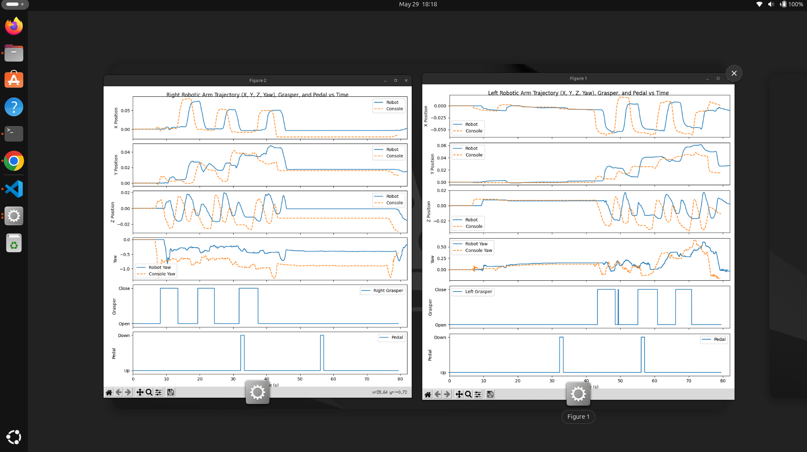
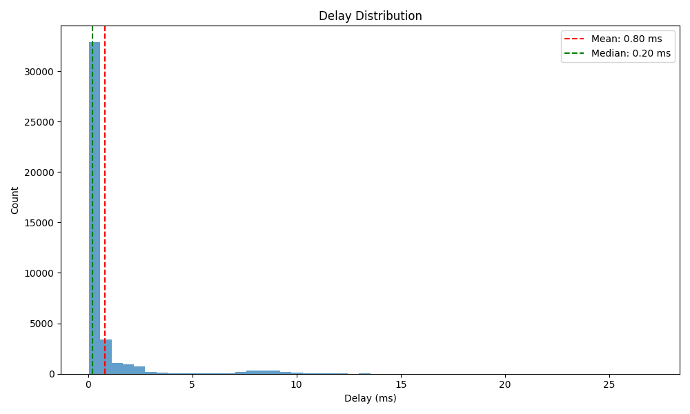

# Undergraduate Research Trial Task Submission
## 1. Summary

I successfully set up the simulation and noticed discrepancies between expected replay trajectories and actual replay trajectories.
I was able to quantify these differences, and identified that it is likely because the simulation was replaying packets and simulating physics at an inconsistent rate.

I was able to build a system that repeatedly read output from PyBullet's `getCameraImage()` function, then
asynchronously converted the data into image files and wrote them to disk. However, I noticed that the data
was mostly blank, and realized that SurRol uses the `pybullet-rendering` library to
intercept the output of `getCameraImage()` in order to integrate PyBullet with an external renderer.
Unfortunately, despite finding some commented out code that may have been able to generate the correct output,
I was unable to use it. The program outputs color renderings to an RGB directory, but mostly outputs blank/garbage data
to the depth frame and object segmentation directories.

The program has also been modified with the addition of profiling information and a couple unit tests.
Testing indicates that the program can still run at 40FPS even if scene renderings are saved every frame, thanks to thread computing.

## 2. Environment and Setup
I'm running this project on a Linux laptop with an Nvidia GPU on Ubuntu 24.04. 
I was able to set up all instructions per usual, but I had to install a few extra packages.
There are no extra setup instructions needed to run my modifications.

## 3. Part 1: Simulator Setup
When the replay data is imported it appears to be desynced, but I understand that is part of the assignment.

Video: https://www.youtube.com/watch?v=qr9gof-MeRk
## 4. Part 2: Data Visualization and Trajectory Comparison
The replay script is sending packets at around 500Hz, which is around a packet every 2ms. Packets contain commands for the PSMs, not full simulator data. Running the same replay file results in different results each time, with usually only one or no triangles being transferred to the other side.



I notice that the robot actions do somewhat match what the console is playing in the X, Z, and Yaw directions, but not the Y direction. 

On the kinematics graphs there is a phase delay between the robot and the console caused by the delay between me starting the simulation and starting the replay. This isn't a problem.

To quantify the difference between the expected trajectories and the simulated one, 
I took the difference between the robot and console for each statistic over time, and averaged them.

| Stat  | Left Arm   | Right Arm  |
|-------|------------|------------|
| X pos | -0.0002996 | -0.0080175 |
| Y pos | -0.0046979 | -0.0040785 |
| Z pos | -0.0037771 | -0.0081671 |
| Yaw   | -0.0398124 | -0.4016063 |

Yaw seems to consistently be offset at very high amounts compared to the other statistics.



Looking at the delay graph a lot of packets are being processed way beyond 2ms (max 13ms). I'm assuming the simulation doesn't validate packet order, so if a packet isn't processed or doesn't arrive in time an out-of-order packet might be processed first.
However, it could also be the case that this simulator is not frame-independent and thus lag spikes will cause physics differences. This is much more likely.

Either way, this would cause a simulation desync because the replay only stores input data, not the actual state of the simulation. So if the grabber were to collide with a peg when it did not at the time of recording, that will offset the grabber's position for the rest of the replay.

One way I thought of to try to replay the data properly was to slow down the rate that packets are sent, so I reduced the frequency by 10x to 50Hz. By doing this, the simulation was slightly more consistent, as I had one time where the first two pegs were successfully placed on the other side, but it still had problems.

A more permanent fix would involve modification of the simulation environment in two ways. First, it needs to validate packet order to prevent desyncing. Second, it should store packets in a buffer and replay at a guaranteed frequency. If for some reason the buffer runs out, the physics simulation should pause.
Lastly the simulation should be framerate-independent.

The data collected for this part can be found in `SurRol_dVTrainer/tests/dVTrainer/Data/exp_data_15/no_fault/part2data`.

## 5. Part 3: Simulation Development

### (Trying to) export frames

The first thing I did was identify where the main simulation loop was. 
After skimming a little I noticed the function `getCameraImage()` from PyBullet that seemed to return exactly what was asked for.
I noticed commented out code that would convert this data into an image, so I uncommented it and used PIL to convert it.


The RGB frame looked like this at first, which did not look correct. I turned to Gemini to try to come up with a fix, which
insisted that it was a NumPy formatting error - it was not.

The PyBullet documentation gave me a good idea of what `getCameraImage()` returns, but not much else.
I was also confused as to why in its other usages, the results of `getCameraImage()` were unused.

Once I found the [pybullet-rendering](https://github.com/ikalevatykh/pybullet_rendering) documentation it made more sense.
This allows external renderers to intercept `getCameraImage()` and return different rendering results, which is done
by inheriting `BaseRenderer` and implementing the `render_frame` method. By altering the parameter `frame` passed into that method,
that changes what PyBullet's `getCameraImage()` returns.

I traced SurRol's external renderer to `surrol/gui/pybullet_renderer.py` and studied the code. The `frame` parameter was untouched
which would explain why I was not seeing anything. I uncommented some code that would take a screenshot of the rendering and
put that in `frame.color_img`, which successfully allowed me to extract that in `multiple_scenes_console_replay.py`.
However, that is just a screenshot and not the RGB frames.


I see a lot of additional commented out code that would potentially allow me to properly extract the requested data.
It looks like it would save data from the Panda3D camera into a buffer to allow the depth maps to be generated.
However, I have had difficulty understanding it, and it threw errors when I ran it, so I was not able to utilize it.

I have tried looking at the panda3d-based renderer provided by pybullet-rendering (`P3dRenderer`), but that seems to diverge from what SurRol does.
I have also looked at the `getCameraImageTest.py` script in the PyBullet examples.

### Writing to disk

I have split output into three folders, one for RGB, one for depth, and one for segmentation masks.

Every nth frame a new thread is spawned to read the output of `getCameraImage()`, convert the NumPy arrays to images, and save them to disk using PIL.

Multithreading allows the simulation to continue running without blocking the main thread with file writes.

## 6. Code Changes

### multiple_scenes_console_replay.py

- threading, tracemalloc, PIL, pathlib, and matplotlib were imported
- Path names for the directories that will hold frame data were added
- New fields were added to `SurgicalSimulatorBimanual` to count frames since last capture and gather profiling data.
- Profiling was added to `p.getCameraImage()`
- Code was added in the simulation step function to spawn threads that runs `save_images()`, which processes and saves frame data
- Profiling was added to check how long a simulation step takes
- Launch arguments were added
- Unit tests for `save_images()` and `clear_image_directories()` were added

### pybullet_renderer.py
- `frame` parameter was updated so `render_frame()` returns a screenshot back to PyBullet

### touch_haptic.py
- Disabled a problematic import that has to do with not having actual haptic hardware

### plot_kinematics_example.py
- Added code that averages the robot and console data's differences and prints that to console

## 7. Usage Instructions

`multiple_scenes_console_replay.py` now takes in arguments:
- `--do_not_capture_frames`: Disable frame saving
- `--frame_capture_interval`: Sets the value *n* as mentioned in the task instructions, default 5
- `--frame_capture_directory`: Sets the directory that frame capture data is saved to, default `dVTrainer/Data/`
  - Make sure to add a slash to the end of the name
- `--test`: Run unit tests
- `--profiler`: Enable profiling stats, default FALSE

Example:

`python multiple_scenes_console_replay.py --do_not_capture_frames`

`python multiple_scenes_console_replay.py --frame_capture_interval 3 --profiler`

`python multiple_scenes_console_replay.py --frame_capture_directory differentDir/`


## 8. Output

- RGB frames can be found in `SurRol_dVTrainer/tests/dVTrainer/Data/rgb`
- Depth frames can be found in `SurRol_dVTrainer/tests/dVTrainer/Data/depth`
- Object segmentation maps can be found in RGB frames can be found in `SurRol_dVTrainer/tests/dVTrainer/Data/seg`

**Important: Each time the simulator is run, these folders are cleared.**
If you want to save the outputs, move them to a different folder before running the simulator again.

## 9. Performance Profiling and Results

The profiler needs to be enabled by adding the launch parameter `--profiler`.

At the end of a session (by clicking Exit in the GUI, not by Ctrl+Cing in console) the program
will print the average FPS, average frame capture overhead (time it takes for `PyBullet.getCameraImage()` to return),
and a tracemalloc list indicating which parts of the script are using the most memory to the console.

Here are some profiler stats from various runs:

### Frame capture disabled

```
======= PROFILER STATS =======
Average FPS: 50.80907498844487fps
Average frame capture overhead: 19.681523433115494ms
Tracemalloc memory usage by all threads related to this script:
multiple_scenes_console_replay.py:2249: size=62.8 KiB, count=1089, average=59 B
multiple_scenes_console_replay.py:2327: size=45.2 KiB, count=342, average=135 B
multiple_scenes_console_replay.py:1771: size=5416 B, count=24, average=226 B
multiple_scenes_console_replay.py:2150: size=1448 B, count=2, average=724 B
multiple_scenes_console_replay.py:2248: size=1000 B, count=2, average=500 B
multiple_scenes_console_replay.py:2431: size=608 B, count=1, average=608 B
...
```

### Frame capture enabled, n = 5

```
======= PROFILER STATS =======
Average FPS: 42.22406623639812fps
Average frame capture overhead: 23.683176186806396ms
Tracemalloc memory usage by all threads related to this script:
multiple_scenes_console_replay.py:2245: size=56.3 KiB, count=1150, average=50 B
multiple_scenes_console_replay.py:2323: size=38.9 KiB, count=410, average=97 B
multiple_scenes_console_replay.py:1767: size=5416 B, count=24, average=226 B
multiple_scenes_console_replay.py:2146: size=1448 B, count=2, average=724 B
multiple_scenes_console_replay.py:2506: size=1160 B, count=2, average=580 B
multiple_scenes_console_replay.py:2244: size=1096 B, count=3, average=365 B
...
```

### Frame capture enabled, n = 1

```
======= PROFILER STATS =======
Average FPS: 40.36924257167815fps
Average frame capture overhead: 24.771334221206565ms
Tracemalloc memory usage by all threads related to this script:
multiple_scenes_console_replay.py:2244: size=769 KiB, count=8, average=96.2 KiB
multiple_scenes_console_replay.py:2497: size=256 KiB, count=2, average=128 KiB
multiple_scenes_console_replay.py:2503: size=64.1 KiB, count=2, average=32.0 KiB
multiple_scenes_console_replay.py:2502: size=64.1 KiB, count=2, average=32.0 KiB
multiple_scenes_console_replay.py:2245: size=52.9 KiB, count=1006, average=54 B
multiple_scenes_console_replay.py:2323: size=43.8 KiB, count=617, average=73 B
...
```

Even with n = 1 the simulation was still running at around 40 FPS.

## 10. Tests

Two very basic tests were created. 

One that tests to make sure `clear_image_directories()`, the function that clears the directories where the images
are stored, leaves those folders empty. 

The other tests to make sure that given placeholder data, the `save_frames()` function
writes to disk without issue.

Both tests may be run by executing the command `python multiple_scenes_console_replay.py --test` with expected output:
```
Clear image directories test
rgbDir is empty
depthDir is empty
segDir is empty
Save frames test
Saved four-pixel files. Each pixel should have distinct colors or shades.
```

Most other testing was done by running the script and visually observing the expected output.

## 11. Limitations and Future Improvements

### Part 2

Since there is a slight phase delay of around ~2.5s in my data, the numbers in the table are likely slightly higher than they should be,
but they were all amplified by similar amounts. So when compared to each other, the numbers are still helpful in determining which statistic had the most deviation.

I could likely resolve this by removing the first few seconds of data from the robot data in `plot_kinematics_example.py`.

### Part 3

I am a little worried about the amount of threads I am spawning, as I am spawning a new one every time there are new frames to save.
While it does work, it may be a better idea to instead cache the last x frames, then save those frames in one thread.

The program does not return the correct RGB frames, depth frames, and segmentation masks because
SurRol uses a custom renderer that does not return those to PyBullet at the moment. Therefore, the saved images are mostly blank/black except for RGB frames.
Future work would be put into attempting to understand how SurRol is using Panda3D, and to intercept and extract the proper data.

The program currently outputs images that are hardcoded to 256x256.

## 12. GenAI Use Disclosure
- GPT-5 was used to attempt to understand `pybullet_renderer.py`
- Google Gemini was used to generate a stub for the haptics import that my setup cannot use
- Google Gemini was used to try to diagnose problems when trying to run the simulator for the first time
- Google Gemini suggested using `cv2` to resize the screenshot in `pybullet_renderer.py` to a desired resolution
- Google Gemini helped me debug issues with how the depth array is saved to disk.
  - According to the pybullet-rendering documentation, `depth_pixels` *should* be an array of floats from 0.0 to 1.0.
  - I cross-referenced this with the `getCameraImageTest.py` example script.